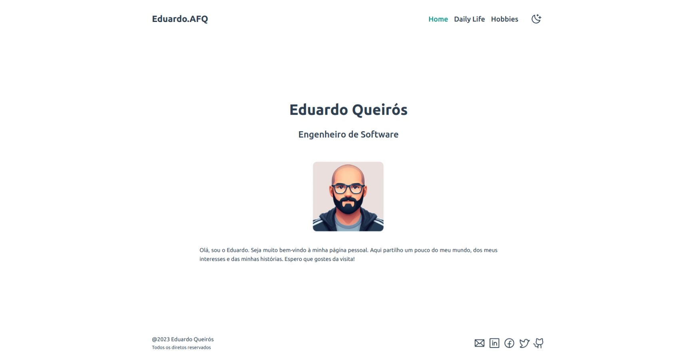
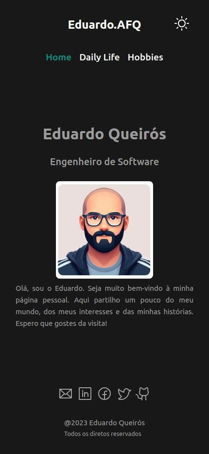

    

 
 

    

# Introdução

Este projeto foi criado no âmbito da UC de Programação Web Avançada (PWA) e trata-se de uma  pagina pessoal estilo "about-me".

O objectivo{objetivo}foi verificar os conhecimentos anteriores relativos à construção de uma página HTML básica, com o acrescido do conceitos de Single Page Application (SPA).

A navegabilidade na página é feita através de links internos que encaminham o utilizador para outras seções da página ou janelas modais.

O site a funcionar numa única página corresponderá ao seu currículo vitae, a partir de uma página index.html. O site deve ter a seguinte:
- Quem Sou Eu?
- O que faço?
- Hobbies

No rodapé da página index.html, bem como nas restantes páginas criadas, deve surgir o rodapé com a indentidade virtual composta por um conjunto de icones de redes sociais populares (ex. facebook, Google +, Twitter, Linkedin, etc.)

## Fases da tarefa

[x] Cada aluno deve ler os recursos partilhados para consolidar os conhecimentos na criação da sites em HTML, e aprender a desenvolver um SPA através de qualquer framework: VueJS ou AngularJS.

[x] Cada aluno deve apresentar uma prototipagem que simule a aparência e a funcionalidade do produto Web, como documentação do projeto. Neste caso, o tipo de prototipagem a usar é o wireframe, onde deve ser apresentado todas as páginas a desenvolver.

- [Wireframe - MiniProj1](https://www.figma.com/file/SPxIbQjglJ34kFrDOo6Tnm/MiniProj1?type=design&node-id=0%3A1&mode=dev)
- Como não erá solucitado não criei o wireframe para a visão _mobile_, contudo, tive cuidado com a responsividade no desenviolvimento da pagina.
- Para os icons da pagina usei: [phosphoricons](https://phosphoricons.com/) em conjunto com [Material Design Icons](https://www.figma.com/community/plugin/740272380439725040/material-design-icons)

[X] Cada aluno deve desenvolver o ficheiro SPA, usando uma framework: VueJS ou AngularJS com os requisitos apresentados.

- Neste projeto usei o VueJS.
- Para criar o projeto segui o [Quick Start](https://vuejs.org/guide/quick-start.html) presente na documentação do vuejs.

[X] Todos os ficheiros desenvolvidos devem ser submetidos na plataforma Git, onde cada aluno deve criar uma conta individual. O projeto no Git deve-se chamar de MiniProj1. A avaliação do projeto será realizada a partir dos ficheiros existentes no Git.

- Link direto para o repositório: [https://github.com/code36u4r60/miniproj1](https://github.com/code36u4r60/miniproj1)
- O projeto encontra-se na pasta `miniproj1` junto do `readme.md`

[x] Todos os ficheiros produzidos devem ser igualmente carregados na "Submissão da Tarefa 2.2", juntamente com um ficheiro a indicar o link do projeto Git criado para este efeito.

- O resultado do projeto está disponível através do link: [https://miniproj1.vercel.app/](https://miniproj1.vercel.app/)

[x] Deveis contribuir para o debate em geral, comentando e opinando (sustentadamente, tal como nas alíneas anteriores) as intervenções dos colegas, e apoiando os colegas na resolução de dúvidas, usando para o efeito o fórum da tarefa.
